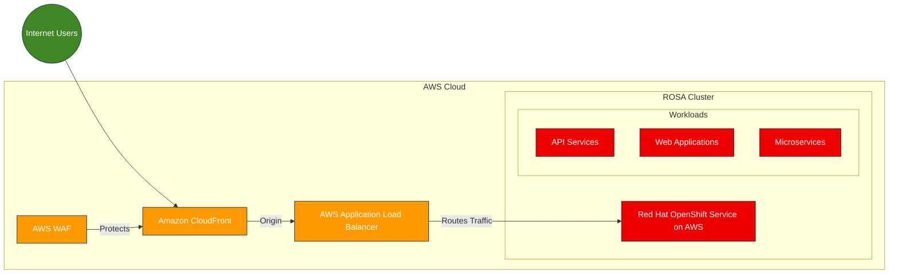
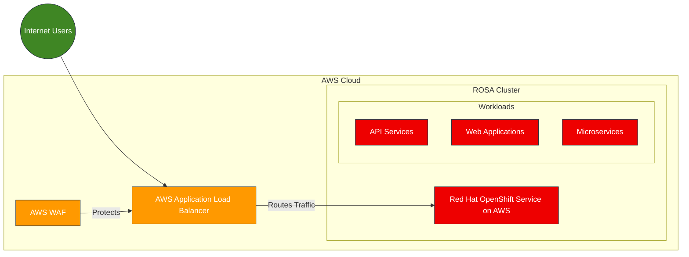
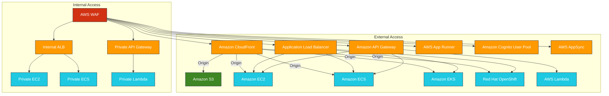
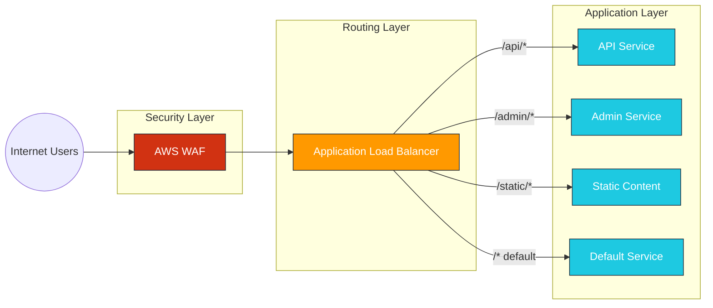
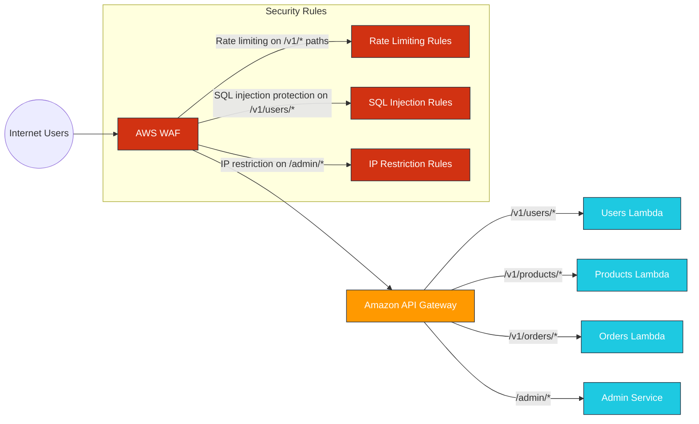
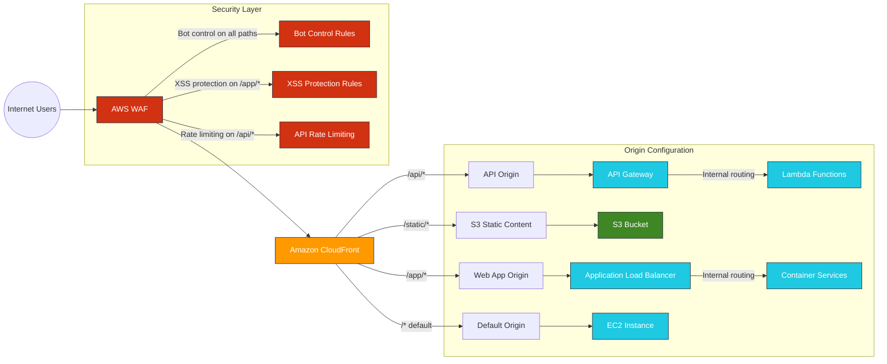
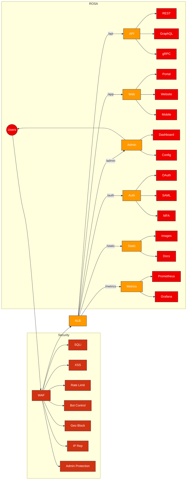
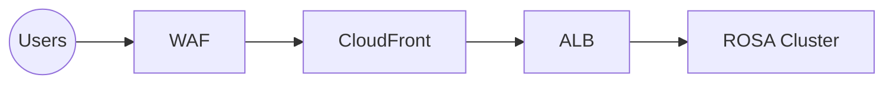
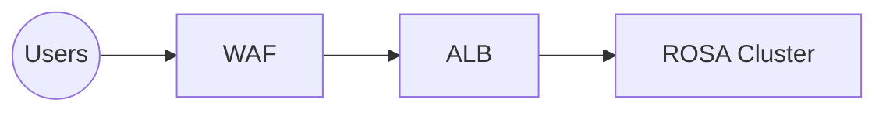

### 1. CloudFront with WAF for ROSA Workloads

### 2. ALB with WAF for ROSA Workloads

### 3. AWS WAF Integrations with AWS Resources

Application Load Balancer (ALB) with path-based routing rules

AWS WAF with API Gateway Path-Based Routing

AWS WAF with CloudFront Path-Based Routing

``` mermaid

flowchart TD
    Users((Internet Users)) --> WAF[AWS WAF]
    WAF --> ALB[Application Load Balancer]
    
    subgraph "Security Layer"
        WAF -->|SQL Injection Protection| SQLi[SQL Injection Rules]
        WAF -->|XSS Protection| XSS[XSS Protection Rules]
        WAF -->|Rate Limiting| RateLimit[Rate Limiting Rules]
        WAF -->|Bot Control| BotControl[Bot Control Rules]
        WAF -->|Geo Restrictions| GeoBlock[Geographic Restrictions]
        WAF -->|IP Reputation| IPRep[IP Reputation Lists]
    end
    
    ALB -->|/api/v1/*| APIRoutes[API Routes]
    ALB -->|/app/*| WebAppRoutes[Web App Routes]
    ALB -->|/admin/*| AdminRoutes[Admin Routes]
    ALB -->|/auth/*| AuthRoutes[Auth Routes]
    ALB -->|/static/*| StaticRoutes[Static Content Routes]
    ALB -->|/metrics/*| MetricsRoutes[Metrics Routes]
    
    subgraph "ROSA Cluster"
        APIRoutes --> APIServices[API Microservices]
        WebAppRoutes --> WebFrontends[Web Frontends]
        AdminRoutes --> AdminPortals[Admin Portals]
        AuthRoutes --> AuthServices[Authentication Services]
        StaticRoutes --> StaticContent[Static Content Servers]
        MetricsRoutes --> Monitoring[Monitoring Services]
        
        subgraph "API Workloads"
            APIServices --> |REST| RESTAPIs[REST APIs]
            APIServices --> |GraphQL| GraphQLAPIs[GraphQL APIs]
            APIServices --> |gRPC| GRPCAPIs[gRPC Services]
        end
        
        subgraph "Web Workloads"
            WebFrontends --> CustomerPortal[Customer Portal]
            WebFrontends --> PublicWebsite[Public Website]
            WebFrontends --> MobileBackend[Mobile App Backend]
        end
        
        subgraph "Admin Workloads"
            AdminPortals --> InternalDashboard[Internal Dashboard]
            AdminPortals --> ConfigManagement[Configuration Management]
            AdminPortals --> UserManagement[User Management]
        end
        
        subgraph "Auth Workloads"
            AuthServices --> OAuth[OAuth Provider]
            AuthServices --> SAML[SAML Integration]
            AuthServices --> MFA[MFA Services]
        end
        
        subgraph "Static Workloads"
            StaticContent --> Images[Image Assets]
            StaticContent --> Documents[Document Assets]
            StaticContent --> Downloads[Downloads]
        end
        
        subgraph "Monitoring Workloads"
            Monitoring --> Prometheus[Prometheus]
            Monitoring --> Grafana[Grafana]
            Monitoring --> Jaeger[Jaeger Tracing]
        end
    end
    
    classDef security fill:#D13212,stroke:#232F3E,color:white
    classDef routing fill:#FF9900,stroke:#232F3E,color:white
    classDef rosa fill:#EE0000,stroke:#232F3E,color:white
    classDef api fill:#1EC9E1,stroke:#232F3E,color:white
    classDef web fill:#3F8624,stroke:#232F3E,color:white
    classDef admin fill:#8C4FFF,stroke:#232F3E,color:white
    classDef auth fill:#FF9D00,stroke:#232F3E,color:white
    classDef static fill:#7AA116,stroke:#232F3E,color:white
    classDef monitoring fill:#527FFF,stroke:#232F3E,color:white
    
    class WAF,SQLi,XSS,RateLimit,BotControl,GeoBlock,IPRep security
    class ALB,APIRoutes,WebAppRoutes,AdminRoutes,AuthRoutes,StaticRoutes,MetricsRoutes routing
    class ROSA rosa
    class APIServices,RESTAPIs,GraphQLAPIs,GRPCAPIs api
    class WebFrontends,CustomerPortal,PublicWebsite,MobileBackend web
    class AdminPortals,InternalDashboard,ConfigManagement,UserManagement admin
    class AuthServices,OAuth,SAML,MFA auth
    class StaticContent,Images,Documents,Downloads static
    class Monitoring,Prometheus,Grafana,Jaeger monitoring
```

##### For path-based routing or forwarding based on URL prefixes, you would need to use:

    Application Load Balancer (ALB) with path-based routing rules

    Amazon API Gateway with path-based routing

    Amazon CloudFront with origin path patterns

##### Common Security Attacks on Externally Exposed ROSA Workloads

##### Application Layer Attacks
SQL Injection: Attackers insert malicious SQL code into application inputs

Cross-Site Scripting (XSS): Injecting client-side scripts into web pages viewed by others

Cross-Site Request Forgery (CSRF): Forcing users to execute unwanted actions

Command Injection: Executing arbitrary commands on the host operating system

Insecure Deserialization: Exploiting flaws in object serialization/deserialization

##### API Security Threats
API Abuse: Excessive API calls causing resource exhaustion

Broken Authentication: Exploiting weak authentication mechanisms

Broken Authorization: Accessing resources without proper permissions

Improper Asset Management: Attacking undocumented or unprotected API endpoints

Insufficient Logging: Attacks going undetected due to poor monitoring

##### Infrastructure Attacks

DDoS Attacks: Overwhelming services with traffic

Container Escape: Breaking out of container isolation

Kubernetes API Server Attacks: Unauthorized access to the control plane

Credential Theft: Stealing service account tokens or credentials

Privilege Escalation: Gaining higher permissions than intended

##### Network-Level Attacks
Man-in-the-Middle: Intercepting and potentially altering communications

Port Scanning: Discovering open ports and services

DNS Poisoning: Redirecting traffic to malicious endpoints

TLS Vulnerabilities: Exploiting weaknesses in encryption

##### Other Common Threats

Brute Force Attacks: Attempting to guess credentials

Credential Stuffing: Using leaked credentials from other breaches

Bots and Scrapers: Automated tools that consume resources or steal data

Supply Chain Attacks: Compromising dependencies or container images

Zero-Day Exploits: Attacks using previously unknown vulnerabilities

# AWS WAF Protection for ROSA Workloads

This document outlines how AWS WAF can protect Red Hat OpenShift Service on AWS (ROSA) workloads from common security attacks.

## Table of Contents
- [Application Layer Attacks](#application-layer-attacks)
- [API Security Threats](#api-security-threats)
- [Infrastructure Attacks](#infrastructure-attacks)
- [Network-Level Attacks](#network-level-attacks)
- [Other Common Threats](#other-common-threats)

## Application Layer Attacks

| Attack Type | AWS WAF Protection |
|-------------|-------------------|
| **SQL Injection** | • AWS Managed Rules: SQL Database Rule Group • AWS Managed Rules: Core Rule Set (CRS) - SQLi rules • Custom regex pattern matching for SQL keywords |
| **Cross-Site Scripting (XSS)** | • AWS Managed Rules: Core Rule Set (CRS) - XSS rules • Custom regex pattern matching for script tags • Body inspection for JavaScript patterns |
| **Cross-Site Request Forgery (CSRF)** | • Custom header inspection rules • Regex pattern matching for referrer headers • Rate-based rules per IP for suspicious patterns |
| **Command Injection** | • AWS Managed Rules: Linux OS Rule Group • AWS Managed Rules: POSIX OS Rule Group • Custom regex for command patterns |
| **Insecure Deserialization** | • AWS Managed Rules: PHP Application Rule Group • Custom inspection of content types • Size constraint rules for serialized objects |

## API Security Threats

| Attack Type | AWS WAF Protection |
|-------------|-------------------|
| **API Abuse** | • Rate-based rules per IP address • Rate-based rules per session token • AWS Managed Rules: Bot Control Rule Group |
| **Broken Authentication** | • AWS Managed Rules: Known Bad Inputs Rule Group • Custom header inspection for authentication tokens • Rate-based rules for failed authentication attempts |
| **Broken Authorization** | • Custom rules for path traversal patterns • AWS Managed Rules: Core Rule Set (CRS) - Path traversal rules • Header inspection for authorization tokens |
| **Improper Asset Management** | • Custom rules for blocking undocumented endpoints • Regex pattern matching for path structures • IP-based access control for admin endpoints |
| **Insufficient Logging** | • AWS WAF logging to CloudWatch Logs • AWS WAF logging to S3 • AWS WAF logging to Kinesis Data Firehose |

## Infrastructure Attacks

| Attack Type | AWS WAF Protection |
|-------------|-------------------|
| **DDoS Attacks** | • Rate-based rules per IP address • AWS Shield integration • AWS Managed Rules: Anonymous IP List Rule Group |
| **Container Escape** | • AWS Managed Rules: Linux OS Rule Group • Custom rules for container escape patterns • Path traversal detection |
| **Kubernetes API Server Attacks** | • IP-based access control rules • Geo-restriction rules • Rate-based rules for API server endpoints |
| **Credential Theft** | • AWS Managed Rules: Known Bad Inputs Rule Group • Custom rules for credential exposure patterns • Rate-based rules for authentication endpoints |
| **Privilege Escalation** | • AWS Managed Rules: Admin Protection Rule Group • Custom rules for admin paths • IP-based access control for sensitive operations |

## Network-Level Attacks

| Attack Type | AWS WAF Protection |
|-------------|-------------------|
| **Man-in-the-Middle** | • Custom header inspection for secure headers • AWS Managed Rules: Core Rule Set (CRS) • TLS configuration enforcement (via CloudFront) |
| **Port Scanning** | • Rate-based rules per IP address • AWS Managed Rules: Anonymous IP List Rule Group • AWS Shield integration |
| **DNS Poisoning** | • Limited direct protection (better handled by Route 53) • Custom header inspection for host headers • IP reputation filtering |
| **TLS Vulnerabilities** | • Limited direct protection (better handled by CloudFront/ALB) • Custom header inspection for secure headers • Protocol version enforcement (via CloudFront) |

## Other Common Threats

| Attack Type | AWS WAF Protection |
|-------------|-------------------|
| **Brute Force Attacks** | • Rate-based rules per IP address • Rate-based rules for login endpoints • AWS Managed Rules: Bot Control Rule Group |
| **Credential Stuffing** | • AWS Managed Rules: Bot Control Rule Group • Rate-based rules per IP address • CAPTCHA integration |
| **Bots and Scrapers** | • AWS Managed Rules: Bot Control Rule Group • AWS Managed Rules: Account Takeover Prevention (ATP) • Rate-based rules with CAPTCHA action |
| **Supply Chain Attacks** | • Limited direct protection • AWS Managed Rules: Core Rule Set (CRS) • Custom rules for dependency inclusion patterns |
| **Zero-Day Exploits** | • AWS Managed Rules: Core Rule Set (CRS) • Rate-based rules for anomalous traffic • Regular rule updates from AWS Threat Intelligence |

## Implementation Architecture

For a visual representation of how AWS WAF protects ROSA workloads, refer to the architecture diagrams below:

### CloudFront with WAF for ROSA

### ALB with WAF for ROSA

## Additional Resources

- [AWS WAF Documentation](https://docs.aws.amazon.com/waf/)
- [AWS Managed Rules for WAF](https://docs.aws.amazon.com/waf/latest/developerguide/aws-managed-rule-groups.html)
- [Red Hat OpenShift Service on AWS](https://aws.amazon.com/rosa/)
- [AWS WAF Security Automations](https://aws.amazon.com/solutions/implementations/aws-waf-security-automations/)

# AWS WAF WebACL Best Practices for ROSA

This document outlines best practices for implementing AWS WAF WebACLs with Red Hat OpenShift Service on AWS (ROSA).

## One WebACL per Cluster (Recommended)

### Advantages:
- **Simplified management and monitoring**
- **Consistent security posture** across the entire cluster
- **Lower cost** (fewer WebACLs to pay for)
- **Easier to maintain rule consistency**
- **Centralized logging and metrics**

### When to use:
- When security requirements are similar across all applications
- For smaller organizations with centralized security management
- When cost optimization is important
- For initial deployments before fine-tuning security needs

## Multiple WebACLs (Per Namespace/Application)

### Advantages:
- **More granular security controls**
- **Different security policies** for different applications
- **Ability to customize rules** for specific application needs
- **Isolation between teams/applications**
- **Reduced blast radius** if configuration issues occur

### When to use:
- For multi-tenant environments with different security requirements
- When different teams manage different applications
- For applications with varying compliance requirements
- When some applications need specialized protection rules

## Best Practice Recommendation

For most ROSA deployments, start with **one WebACL per cluster** attached to your ALB/CloudFront distribution, then:

1. Use **path-based conditions** within the WebACL to apply different rule groups to different applications/namespaces
2. Implement **scope-down statements** to target specific rules to specific paths
3. Consider multiple WebACLs only when security requirements significantly differ between applications
4. Evaluate **cost vs. security granularity** tradeoffs for your specific use case
